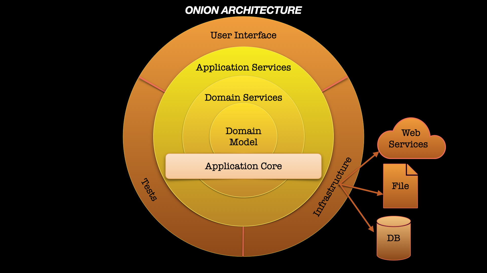
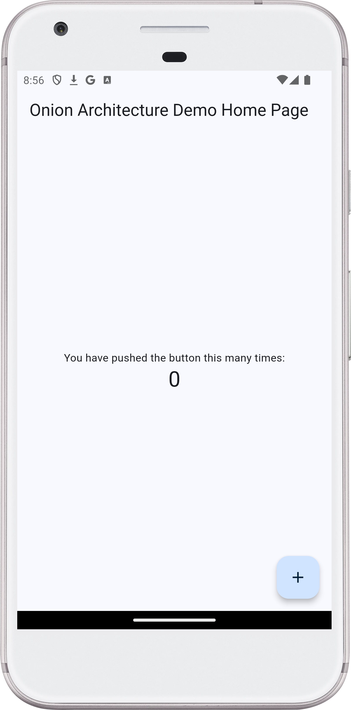

[](https://stand-with-ukraine.pp.ua)
[](https://pub.dev/packages/flutter_lints)
[](https://github.com/flutter/flutter/wiki/Style-guide-for-Flutter-repo)
[](https://codecov.io/gh/Turskyi/flutter_onion_architecture_counter)


# Flutter Onion Architecture Counter With Stream

This project is a refactored version of the
[default Flutter counter app](https://dartpad.dev/?sample=counter),
demonstrating how it could be implemented in a production environment using
Onion Architecture, originally introduced by
[Jeffrey Palermo](https://jeffreypalermo.com/about/) in his article
[The Onion Architecture](https://jeffreypalermo.com/2008/07/the-onion-architecture-part-1/).

The default counter app is often criticized for its simplicity and lack of
real-world applicability. This example showcases a more maintainable and
scalable approach, incorporating immutability, dependency injection, and
reactive state management
using [streams](https://dart.dev/libraries/async/using-streams).

<!--suppress CheckImageSize -->
<a href="https://sites.libsyn.com/412964/onion-architecture-episode-2">
<!--suppress CheckImageSize -->

</a>

## Architecture Overview

The project follows the four main layers of Onion Architecture:

1. **Domain Model**: Core business logic and entities.
2. **Domain Services**: Business rules and operations.
3. **Application Services**: Application-specific logic and orchestration.
4. **Outermost Layer**: Includes User Interface, Infrastructure (DB and/or WS),
   and Tests.

### Domain Model Layer

Contains the `Counter` entity. This layer does not depend on anything else,
which is evident from the imports in the class.

### Domain Services Layer

Contains the `IncrementCounter` interface and its implementation
`IncrementCounterFakeImpl`. This layer depends only on the Domain Model.

### Application Services Layer

Contains the `CounterPresenter` which manages the state and business logic.
This layer depends on both Domain Services and Domain Model.

### Outermost Layer

- **User Interface Component**: Contains the `MyHomePage` widget and the
  `main` function with `MyApp` widget.
- **Infrastructure Component**: Contains the `CounterDataSource` interface and
  its fake implementation `FakeCounterDataSource`, which uses a `Stream` for the
  `watch` method.
- **Tests**: Adjusted for Onion Architecture, highlighting their importance as
  a component of the outermost layer.

The Infrastructure, User Interface, and Tests components have access to all
inner layers.

### Note on Layer Separation

For the sake of simplicity, the inner layers are not decoupled into separate
packages in this example. In a production environment, it is essential to
enforce the dependency flow by separating these layers into different
packages. This ensures that, for example, the Domain Model layer cannot access
the User Interface layer.

### Project Structure

The simplified structure of the project is as follows:

```
lib/
├── main.dart
├── core/
│   ├── application_services/
│   └── domain/
│       ├── model/
│       └── services/
├── infrastructure/
└── user_interface/
```

## Getting Started

To get started with this project, clone the repository and run the following
commands:

```bash
flutter pub get
flutter run
```

You can also test the implementation directly on DartPad:
https://dartpad.dev/?id=162cc336713fefc21013d2dae0382adf

## Running Tests

To run the tests, use the following command:

```bash
flutter test
```

The tests are adjusted for Onion Architecture, demonstrating how to test each
layer independently and ensuring the overall integrity of the application.

## Full Implementation

This implementation is so simple that it can even fit in the README:

```dart
import 'dart:async';

import 'package:flutter/material.dart';

// Domain Model Layer
class Counter {
  const Counter(this.value);

  final int value;

  Counter copyWith({int? value}) {
    return Counter(value ?? this.value);
  }
}

// Domain Services Layer
abstract interface class IncrementCounter {
  const IncrementCounter();

  void increment(Counter counter);

  Stream<Counter> get counterStream;
}

class IncrementCounterFakeImpl implements IncrementCounter {
  IncrementCounterFakeImpl(this.dataSource) {
    _init();
  }

  final CounterDataSource dataSource;
  final StreamController<Counter> _controller = StreamController<Counter>();

  Future<void> _init() async {
    dataSource.watch().listen((Counter counter) {
      _controller.add(counter);
    });
  }

  @override
  void increment(Counter counter) async {
    final Counter newCounter = counter.copyWith(value: counter.value + 1);
    await dataSource.saveCounter(newCounter);
  }

  @override
  Stream<Counter> get counterStream => _controller.stream;
}

// Application Services Layer
class CounterPresenter {
  CounterPresenter(this.incrementCounter) {
    incrementCounter.counterStream.listen(_updateCounter);
  }

  final IncrementCounter incrementCounter;
  Counter? _counter;
  final StreamController<Counter> _controller = StreamController<Counter>();

  Stream<Counter> get counterStream => _controller.stream;

  void increment() {
    if (_counter != null) {
      incrementCounter.increment(_counter!);
    }
  }

  void _updateCounter(Counter counter) {
    _counter = counter;
    _controller.add(_counter!);
  }

  void dispose() => _controller.close();
}

// Outermost layer.

// User Interface Component
class MyHomePage extends StatefulWidget {
  const MyHomePage({
    required this.title,
    required this.presenter,
    super.key,
  });

  final String title;
  final CounterPresenter presenter;

  @override
  State<MyHomePage> createState() => _MyHomePageState();
}

class _MyHomePageState extends State<MyHomePage> {
  @override
  Widget build(BuildContext context) {
    return Scaffold(
      appBar: AppBar(
        title: Text(widget.title),
      ),
      body: Center(
        child: Column(
          mainAxisAlignment: MainAxisAlignment.center,
          children: <Widget>[
            const Text(
              'You have pushed the button this many times:',
            ),
            StreamBuilder<Counter>(
              stream: widget.presenter.counterStream,
              initialData: const Counter(0),
              builder: (BuildContext context, AsyncSnapshot<Counter> snapshot) {
                return Text(
                  '${snapshot.data?.value ?? 0}',
                  style: Theme
                      .of(context)
                      .textTheme
                      .headlineMedium,
                );
              },
            ),
          ],
        ),
      ),
      floatingActionButton: FloatingActionButton(
        onPressed: widget.presenter.increment,
        tooltip: 'Increment',
        child: const Icon(Icons.add),
      ),
    );
  }

  @override
  void dispose() {
    widget.presenter.dispose();
    super.dispose();
  }
}

class MyApp extends StatelessWidget {
  const MyApp({super.key});

  @override
  Widget build(BuildContext context) {
    final FakeCounterDataSource dataSource = FakeCounterDataSource();
    final IncrementCounterFakeImpl incrementCounter =
    IncrementCounterFakeImpl(dataSource);
    final CounterPresenter presenter = CounterPresenter(incrementCounter);

    return MaterialApp(
      title: 'Flutter Demo',
      debugShowCheckedModeBanner: false,
      theme: ThemeData(
        colorSchemeSeed: Colors.blue,
      ),
      home: MyHomePage(title: 'Flutter Demo Home Page', presenter: presenter),
    );
  }
}

void main() => runApp(const MyApp());

// Infrastructure Component
abstract interface class CounterDataSource {
  const CounterDataSource();

  Stream<Counter> watch();

  Future<void> saveCounter(Counter counter);
}

class FakeCounterDataSource implements CounterDataSource {
  FakeCounterDataSource() {
    _controller.add(_counter);
  }

  Counter _counter = const Counter(0);
  final StreamController<Counter> _controller = StreamController<Counter>();

  @override
  Stream<Counter> watch() => _controller.stream;

  @override
  Future<void> saveCounter(Counter counter) async {
    await Future<void>.delayed(Duration.zero);
    _counter = counter;
    _controller.add(_counter);
  }
}
```

### Screenshot:

<!--suppress CheckImageSize -->
